# EduPlatform — Phase 1: ERD & Database Architecture

> Production-grade design doc for a Udemy-style university learning platform supporting both **online** and **offline** courses.
> Phase 1 covers **only** entity relationships, schema, indexing, soft-delete, audit, and enums.
> Code (entities, migrations, controllers) follows in later phases.

---

## 1. Design Principles

| Principle | Decision |
|---|---|
| Primary keys | `UUID` (v7 preferred for index locality, generated app-side) |
| Soft delete | `deleted_at TIMESTAMPTZ NULL` on every domain table + Hibernate `@SQLRestriction` |
| Audit columns | `created_at`, `updated_at`, `created_by`, `updated_by`, `deleted_at`, `version` (optimistic lock) |
| Timestamps | `TIMESTAMPTZ` (UTC) — never naive timestamps |
| Money | `NUMERIC(12,2)` + ISO-4217 `currency CHAR(3)` (never `float`) |
| Enums | Stored as `VARCHAR` + DB `CHECK` constraints (portable, evolvable) — *not* PostgreSQL `ENUM` types |
| Naming | `snake_case` tables, plural (`users`, `courses`) — singular column names |
| Cross-cutting | All FKs `ON DELETE RESTRICT` by default; soft-delete handles lifecycle |
| Tenancy | Single-tenant for v1; `tenant_id` reserved but unused |
| Multilingual | i18n deferred to v2 via separate `*_translations` tables |

---

## 2. Bounded Contexts (Logical Modules)

```
┌─────────────────────────────────────────────────────────────────────┐
│  IDENTITY          │  AUTH tokens, users, roles, permissions        │
│  TUTOR             │  Tutor profiles, expertise, approval workflow  │
│  CATALOG           │  Categories, tags                              │
│  COURSE            │  Courses, modules, lessons, media              │
│  ROOM              │  Rooms, schedules, bookings, approvals         │
│  ENROLLMENT        │  Enrollments, attendance, progress             │
│  PAYMENT           │  Orders, payments, invoices, pricing rules     │
│  REVIEW            │  Course reviews, ratings                       │
│  NOTIFICATION      │  In-app + email notifications, templates       │
│  AUDIT             │  Audit log, request log, security events       │
│  MEDIA             │  Files, uploads, signed URLs                   │
└─────────────────────────────────────────────────────────────────────┘
```

Each context maps to a Java package (`com.eduplatform.<context>`).

---

## 3. ERD (Mermaid)

```mermaid
erDiagram
    USERS ||--o| TUTOR_PROFILES                       : "may be"
    USERS ||--o{ REFRESH_TOKENS                       : owns
    USERS ||--o{ USER_IDENTITIES                      : "auth via"
    USERS ||--o{ OAUTH_AUTH_STATES                    : "linking"
    USERS ||--o{ USER_ROLES                           : assigned
    ROLES ||--o{ USER_ROLES                           : grants
    ROLES ||--o{ ROLE_PERMISSIONS                     : has
    PERMISSIONS ||--o{ ROLE_PERMISSIONS               : in

    TUTOR_PROFILES ||--o{ TUTOR_EXPERTISES            : declares
    CATEGORIES   ||--o{ TUTOR_EXPERTISES              : referenced
    TUTOR_PROFILES ||--o{ TUTOR_APPROVAL_REQUESTS     : submits
    USERS ||--o{ TUTOR_APPROVAL_REQUESTS              : "reviewed by"

    CATEGORIES ||--o{ CATEGORIES                      : "parent of"
    CATEGORIES ||--o{ COURSE_CATEGORIES               : tagged
    COURSES    ||--o{ COURSE_CATEGORIES               : tagged
    COURSES    ||--o{ COURSE_TAGS                     : tagged
    TAGS       ||--o{ COURSE_TAGS                     : tagged

    TUTOR_PROFILES ||--o{ COURSES                     : authors
    COURSES ||--o{ COURSE_MODULES                     : contains
    COURSE_MODULES ||--o{ LESSONS                     : contains
    LESSONS ||--o{ LESSON_MEDIA                       : has
    MEDIA_FILES ||--o{ LESSON_MEDIA                   : referenced

    COURSES ||--o| ONLINE_COURSE_DETAILS              : "if ONLINE"
    COURSES ||--o| OFFLINE_COURSE_DETAILS             : "if OFFLINE"
    OFFLINE_COURSE_DETAILS ||--o{ OFFLINE_SESSIONS    : scheduled

    ROOMS ||--o{ ROOM_IMAGES                          : has
    ROOMS ||--o{ ROOM_AVAILABILITY_SLOTS              : exposes
    ROOMS ||--o{ ROOM_BOOKINGS                        : booked
    OFFLINE_COURSE_DETAILS ||--o{ ROOM_BOOKINGS       : reserves
    ROOM_BOOKINGS ||--o{ ROOM_BOOKING_APPROVALS       : reviewed
    USERS ||--o{ ROOM_BOOKING_APPROVALS               : "decided by"

    COURSES ||--o{ ENROLLMENTS                        : has
    USERS   ||--o{ ENROLLMENTS                        : enrolls
    ENROLLMENTS ||--o{ LESSON_PROGRESS                : tracks
    LESSONS     ||--o{ LESSON_PROGRESS                : referenced
    ENROLLMENTS ||--o{ ATTENDANCE_RECORDS             : "if offline"
    OFFLINE_SESSIONS ||--o{ ATTENDANCE_RECORDS        : marked

    COURSES ||--o{ COURSE_REVIEWS                     : reviewed
    USERS   ||--o{ COURSE_REVIEWS                     : writes

    USERS ||--o{ ORDERS                               : places
    ORDERS ||--o{ ORDER_ITEMS                         : contains
    COURSES ||--o{ ORDER_ITEMS                        : "purchased as"
    ORDERS ||--o{ PAYMENTS                            : settled
    PAYMENTS ||--o{ PAYMENT_EVENTS                    : audited
    ROOMS    ||--o{ ROOM_PRICING_RULES                : priced

    USERS ||--o{ NOTIFICATIONS                        : receives
    NOTIFICATION_TEMPLATES ||--o{ NOTIFICATIONS       : "rendered from"

    USERS ||--o{ AUDIT_LOGS                           : "acted by"
```



> Legend: `||--o{` one-to-many, `||--o|` one-to-zero/one. Soft-delete and audit columns omitted for clarity.

---

## 4. Tables (PostgreSQL DDL Sketch)

> Full SQL appears in Flyway migrations (Phase 3). This is the canonical reference.

### 4.1 Identity & Access

```sql
-- users: every authenticatable account.
-- password_hash is NULLABLE: social-only accounts (Google/Facebook/Apple) have no local password.
CREATE TABLE users (
    id                UUID PRIMARY KEY,
    email             CITEXT NOT NULL UNIQUE,
    phone             VARCHAR(32),
    password_hash     VARCHAR(255),                     -- NULL for social-only accounts
    first_name        VARCHAR(80)  NOT NULL,
    last_name         VARCHAR(80)  NOT NULL,
    avatar_media_id   UUID REFERENCES media_files(id),
    status            VARCHAR(20)  NOT NULL DEFAULT 'ACTIVE',  -- ACTIVE, LOCKED, SUSPENDED, DELETED
    email_verified_at TIMESTAMPTZ,
    last_login_at     TIMESTAMPTZ,
    failed_logins     SMALLINT     NOT NULL DEFAULT 0,
    locale            VARCHAR(8)   NOT NULL DEFAULT 'en',
    version           BIGINT       NOT NULL DEFAULT 0,
    created_at        TIMESTAMPTZ  NOT NULL DEFAULT now(),
    updated_at        TIMESTAMPTZ  NOT NULL DEFAULT now(),
    deleted_at        TIMESTAMPTZ,
    created_by        UUID,
    updated_by        UUID,
    CONSTRAINT chk_user_status CHECK (status IN ('ACTIVE','LOCKED','SUSPENDED','DELETED'))
);
CREATE INDEX idx_users_status        ON users(status) WHERE deleted_at IS NULL;
CREATE INDEX idx_users_email_lower   ON users(lower(email));
CREATE INDEX idx_users_created_at    ON users(created_at DESC);

-- roles: USER, TUTOR, ADMIN, SUPER_ADMIN
CREATE TABLE roles (
    id          UUID PRIMARY KEY,
    code        VARCHAR(40) NOT NULL UNIQUE,        -- USER, TUTOR, ADMIN, SUPER_ADMIN
    name        VARCHAR(80) NOT NULL,
    description TEXT,
    is_system   BOOLEAN NOT NULL DEFAULT FALSE,     -- system roles cannot be deleted
    created_at  TIMESTAMPTZ NOT NULL DEFAULT now(),
    updated_at  TIMESTAMPTZ NOT NULL DEFAULT now()
);

-- permissions: fine-grained, e.g. course.publish, room.approve
CREATE TABLE permissions (
    id          UUID PRIMARY KEY,
    code        VARCHAR(80) NOT NULL UNIQUE,        -- e.g. 'course:publish'
    resource    VARCHAR(40) NOT NULL,               -- course, room, tutor, ...
    action      VARCHAR(40) NOT NULL,               -- create, read, update, delete, approve
    description TEXT,
    created_at  TIMESTAMPTZ NOT NULL DEFAULT now()
);

CREATE TABLE role_permissions (
    role_id       UUID NOT NULL REFERENCES roles(id) ON DELETE CASCADE,
    permission_id UUID NOT NULL REFERENCES permissions(id) ON DELETE CASCADE,
    PRIMARY KEY (role_id, permission_id)
);

CREATE TABLE user_roles (
    user_id    UUID NOT NULL REFERENCES users(id) ON DELETE CASCADE,
    role_id    UUID NOT NULL REFERENCES roles(id) ON DELETE RESTRICT,
    granted_at TIMESTAMPTZ NOT NULL DEFAULT now(),
    granted_by UUID,
    PRIMARY KEY (user_id, role_id)
);

-- user_identities: external auth providers linked to a single user.
-- One user can have multiple identities (e.g. LOCAL + GOOGLE), enabling account merge.
CREATE TABLE user_identities (
    id              UUID PRIMARY KEY,
    user_id         UUID NOT NULL REFERENCES users(id) ON DELETE CASCADE,
    provider        VARCHAR(20) NOT NULL,             -- LOCAL, GOOGLE, FACEBOOK, APPLE
    provider_user_id VARCHAR(255) NOT NULL,           -- the 'sub' claim / provider's user id
    email_at_provider CITEXT,                         -- email returned by provider at link time
    email_verified  BOOLEAN NOT NULL DEFAULT FALSE,   -- as asserted by the provider
    display_name    VARCHAR(160),
    avatar_url      VARCHAR(512),
    -- Apple-specific: relay email + private-email flag; full name returned only on first auth.
    is_private_email BOOLEAN NOT NULL DEFAULT FALSE,
    -- raw provider profile snapshot (kept for audit/debug; refreshed on each login)
    raw_profile     JSONB,
    -- OAuth refresh token (provider-side), encrypted at rest via app-level crypto helper
    provider_refresh_token_encrypted BYTEA,
    last_login_at   TIMESTAMPTZ,
    linked_at       TIMESTAMPTZ NOT NULL DEFAULT now(),
    created_at      TIMESTAMPTZ NOT NULL DEFAULT now(),
    updated_at      TIMESTAMPTZ NOT NULL DEFAULT now(),
    deleted_at      TIMESTAMPTZ,
    CONSTRAINT chk_identity_provider CHECK (provider IN ('LOCAL','GOOGLE','FACEBOOK','APPLE')),
    -- A given provider account can only be linked to one user
    CONSTRAINT uq_identity_provider_subject UNIQUE (provider, provider_user_id),
    -- A user has at most one identity per provider
    CONSTRAINT uq_identity_user_provider UNIQUE (user_id, provider)
);
CREATE INDEX idx_identity_user     ON user_identities(user_id) WHERE deleted_at IS NULL;
CREATE INDEX idx_identity_provider ON user_identities(provider) WHERE deleted_at IS NULL;

-- Short-lived state for in-flight OAuth/OIDC flows (anti-CSRF + PKCE).
-- Rows are deleted on callback success or expired sweep.
CREATE TABLE oauth_auth_states (
    state              CHAR(64) PRIMARY KEY,             -- random URL-safe token
    provider           VARCHAR(20) NOT NULL,
    code_verifier      VARCHAR(128) NOT NULL,            -- PKCE
    nonce              VARCHAR(128),                     -- OIDC replay protection
    redirect_uri       VARCHAR(512) NOT NULL,
    intent             VARCHAR(20) NOT NULL DEFAULT 'LOGIN',  -- LOGIN, LINK
    link_user_id       UUID REFERENCES users(id) ON DELETE CASCADE,  -- set when intent=LINK
    post_login_redirect VARCHAR(512),
    ip_address         INET,
    user_agent         VARCHAR(255),
    created_at         TIMESTAMPTZ NOT NULL DEFAULT now(),
    expires_at         TIMESTAMPTZ NOT NULL,
    CONSTRAINT chk_oauth_state_provider CHECK (provider IN ('GOOGLE','FACEBOOK','APPLE')),
    CONSTRAINT chk_oauth_state_intent   CHECK (intent IN ('LOGIN','LINK'))
);
CREATE INDEX idx_oauth_state_expires ON oauth_auth_states(expires_at);

-- refresh tokens: rotating, family-tracked, revocable
CREATE TABLE refresh_tokens (
    id            UUID PRIMARY KEY,
    user_id       UUID NOT NULL REFERENCES users(id) ON DELETE CASCADE,
    token_hash    CHAR(64) NOT NULL UNIQUE,         -- SHA-256 hex
    family_id     UUID NOT NULL,                    -- rotation family (reuse-detection)
    parent_id     UUID REFERENCES refresh_tokens(id),
    issued_at     TIMESTAMPTZ NOT NULL DEFAULT now(),
    expires_at    TIMESTAMPTZ NOT NULL,
    revoked_at    TIMESTAMPTZ,
    revoke_reason VARCHAR(40),                      -- ROTATED, LOGOUT, REUSE_DETECTED, ADMIN
    ip_address    INET,
    user_agent    VARCHAR(255)
);
CREATE INDEX idx_refresh_user_active ON refresh_tokens(user_id) WHERE revoked_at IS NULL;
CREATE INDEX idx_refresh_family      ON refresh_tokens(family_id);
CREATE INDEX idx_refresh_expires     ON refresh_tokens(expires_at);
```

### 4.2 Tutor Domain

```sql
CREATE TABLE tutor_profiles (
    id              UUID PRIMARY KEY,
    user_id         UUID NOT NULL UNIQUE REFERENCES users(id) ON DELETE CASCADE,
    headline        VARCHAR(160),
    bio             TEXT,
    years_experience SMALLINT,
    website_url     VARCHAR(255),
    linkedin_url    VARCHAR(255),
    approval_status VARCHAR(20) NOT NULL DEFAULT 'PENDING',  -- PENDING, APPROVED, REJECTED, SUSPENDED
    approved_at     TIMESTAMPTZ,
    approved_by     UUID REFERENCES users(id),
    rejection_reason TEXT,
    rating_avg      NUMERIC(3,2) NOT NULL DEFAULT 0.00,      -- denormalized
    rating_count    INTEGER NOT NULL DEFAULT 0,              -- denormalized
    -- audit
    version    BIGINT NOT NULL DEFAULT 0,
    created_at TIMESTAMPTZ NOT NULL DEFAULT now(),
    updated_at TIMESTAMPTZ NOT NULL DEFAULT now(),
    deleted_at TIMESTAMPTZ,
    created_by UUID, updated_by UUID,
    CONSTRAINT chk_tutor_status CHECK (approval_status IN ('PENDING','APPROVED','REJECTED','SUSPENDED'))
);
CREATE INDEX idx_tutor_approval ON tutor_profiles(approval_status) WHERE deleted_at IS NULL;

CREATE TABLE tutor_expertises (
    tutor_id    UUID NOT NULL REFERENCES tutor_profiles(id) ON DELETE CASCADE,
    category_id UUID NOT NULL REFERENCES categories(id) ON DELETE RESTRICT,
    PRIMARY KEY (tutor_id, category_id)
);

-- Decoupled approval workflow (supports re-submission history)
CREATE TABLE tutor_approval_requests (
    id            UUID PRIMARY KEY,
    tutor_id      UUID NOT NULL REFERENCES tutor_profiles(id) ON DELETE CASCADE,
    status        VARCHAR(20) NOT NULL DEFAULT 'PENDING',  -- PENDING, APPROVED, REJECTED
    decision_note TEXT,
    decided_by    UUID REFERENCES users(id),
    decided_at    TIMESTAMPTZ,
    submitted_at  TIMESTAMPTZ NOT NULL DEFAULT now(),
    created_at    TIMESTAMPTZ NOT NULL DEFAULT now(),
    updated_at    TIMESTAMPTZ NOT NULL DEFAULT now()
);
CREATE INDEX idx_tutor_appr_status ON tutor_approval_requests(status, submitted_at DESC);
```

### 4.3 Catalog

```sql
CREATE TABLE categories (
    id          UUID PRIMARY KEY,
    parent_id   UUID REFERENCES categories(id) ON DELETE RESTRICT,
    slug        VARCHAR(120) NOT NULL UNIQUE,
    name        VARCHAR(120) NOT NULL,
    description TEXT,
    icon_url    VARCHAR(255),
    sort_order  INTEGER NOT NULL DEFAULT 0,
    is_active   BOOLEAN NOT NULL DEFAULT TRUE,
    created_at  TIMESTAMPTZ NOT NULL DEFAULT now(),
    updated_at  TIMESTAMPTZ NOT NULL DEFAULT now(),
    deleted_at  TIMESTAMPTZ,
    created_by UUID, updated_by UUID
);
CREATE INDEX idx_categories_parent ON categories(parent_id) WHERE deleted_at IS NULL;
CREATE INDEX idx_categories_active ON categories(is_active) WHERE deleted_at IS NULL;

CREATE TABLE tags (
    id   UUID PRIMARY KEY,
    slug VARCHAR(60) NOT NULL UNIQUE,
    name VARCHAR(60) NOT NULL,
    created_at TIMESTAMPTZ NOT NULL DEFAULT now()
);
```

### 4.4 Course Domain (shared + ONLINE/OFFLINE specialization)

```sql
CREATE TABLE courses (
    id                  UUID PRIMARY KEY,
    tutor_id            UUID NOT NULL REFERENCES tutor_profiles(id) ON DELETE RESTRICT,
    slug                VARCHAR(160) NOT NULL UNIQUE,
    title               VARCHAR(160) NOT NULL,
    subtitle            VARCHAR(255),
    description         TEXT,
    requirements        TEXT,                  -- bullet list, markdown
    learning_outcomes   TEXT,                  -- bullet list, markdown
    syllabus            TEXT,
    thumbnail_media_id  UUID REFERENCES media_files(id),
    trailer_media_id    UUID REFERENCES media_files(id),
    course_type         VARCHAR(10)  NOT NULL,        -- ONLINE | OFFLINE
    level               VARCHAR(20)  NOT NULL DEFAULT 'ALL',  -- BEGINNER, INTERMEDIATE, ADVANCED, ALL
    language            VARCHAR(8)   NOT NULL DEFAULT 'en',
    is_free             BOOLEAN      NOT NULL DEFAULT FALSE,
    price               NUMERIC(12,2) NOT NULL DEFAULT 0,
    currency            CHAR(3)      NOT NULL DEFAULT 'USD',
    status              VARCHAR(20)  NOT NULL DEFAULT 'DRAFT',  -- DRAFT, IN_REVIEW, PUBLISHED, REJECTED, ARCHIVED
    rejection_reason    TEXT,
    approved_at         TIMESTAMPTZ,
    approved_by         UUID REFERENCES users(id),
    published_at        TIMESTAMPTZ,
    -- denormalized for catalog perf
    rating_avg          NUMERIC(3,2) NOT NULL DEFAULT 0.00,
    rating_count        INTEGER NOT NULL DEFAULT 0,
    enrolled_count      INTEGER NOT NULL DEFAULT 0,
    -- audit
    version    BIGINT NOT NULL DEFAULT 0,
    created_at TIMESTAMPTZ NOT NULL DEFAULT now(),
    updated_at TIMESTAMPTZ NOT NULL DEFAULT now(),
    deleted_at TIMESTAMPTZ,
    created_by UUID, updated_by UUID,
    CONSTRAINT chk_course_type   CHECK (course_type IN ('ONLINE','OFFLINE')),
    CONSTRAINT chk_course_status CHECK (status IN ('DRAFT','IN_REVIEW','PUBLISHED','REJECTED','ARCHIVED')),
    CONSTRAINT chk_course_price  CHECK ((is_free AND price = 0) OR (NOT is_free AND price >= 0))
);
CREATE INDEX idx_courses_status_pub   ON courses(status, published_at DESC) WHERE deleted_at IS NULL;
CREATE INDEX idx_courses_tutor        ON courses(tutor_id) WHERE deleted_at IS NULL;
CREATE INDEX idx_courses_type         ON courses(course_type) WHERE deleted_at IS NULL;
CREATE INDEX idx_courses_search       ON courses USING GIN (to_tsvector('simple', title || ' ' || coalesce(subtitle,'') || ' ' || coalesce(description,'')));

CREATE TABLE course_categories (
    course_id   UUID NOT NULL REFERENCES courses(id) ON DELETE CASCADE,
    category_id UUID NOT NULL REFERENCES categories(id) ON DELETE RESTRICT,
    PRIMARY KEY (course_id, category_id)
);

CREATE TABLE course_tags (
    course_id UUID NOT NULL REFERENCES courses(id) ON DELETE CASCADE,
    tag_id    UUID NOT NULL REFERENCES tags(id) ON DELETE RESTRICT,
    PRIMARY KEY (course_id, tag_id)
);

-- 1:1 specialization for ONLINE
CREATE TABLE online_course_details (
    course_id            UUID PRIMARY KEY REFERENCES courses(id) ON DELETE CASCADE,
    total_video_seconds  INTEGER NOT NULL DEFAULT 0,
    has_certificate      BOOLEAN NOT NULL DEFAULT FALSE,
    drip_enabled         BOOLEAN NOT NULL DEFAULT FALSE
);

-- 1:1 specialization for OFFLINE
CREATE TABLE offline_course_details (
    course_id        UUID PRIMARY KEY REFERENCES courses(id) ON DELETE CASCADE,
    start_date       DATE NOT NULL,
    end_date         DATE NOT NULL,
    weekly_hours     NUMERIC(4,1),
    total_hours      NUMERIC(6,1),
    student_limit    INTEGER NOT NULL,
    enrolled_count   INTEGER NOT NULL DEFAULT 0,
    city             VARCHAR(80),
    address_line     VARCHAR(255),
    CONSTRAINT chk_offline_dates CHECK (end_date >= start_date),
    CONSTRAINT chk_offline_limit CHECK (student_limit > 0)
);

-- Hierarchy under any course (sections)
CREATE TABLE course_modules (
    id          UUID PRIMARY KEY,
    course_id   UUID NOT NULL REFERENCES courses(id) ON DELETE CASCADE,
    title       VARCHAR(160) NOT NULL,
    description TEXT,
    order_index INTEGER NOT NULL,
    created_at  TIMESTAMPTZ NOT NULL DEFAULT now(),
    updated_at  TIMESTAMPTZ NOT NULL DEFAULT now(),
    deleted_at  TIMESTAMPTZ,
    UNIQUE (course_id, order_index)
);
CREATE INDEX idx_modules_course ON course_modules(course_id, order_index) WHERE deleted_at IS NULL;

CREATE TABLE lessons (
    id                UUID PRIMARY KEY,
    module_id         UUID NOT NULL REFERENCES course_modules(id) ON DELETE CASCADE,
    title             VARCHAR(200) NOT NULL,
    description       TEXT,
    content_type      VARCHAR(20) NOT NULL DEFAULT 'VIDEO',  -- VIDEO, TEXT, PDF, QUIZ, LIVE_SESSION
    video_media_id    UUID REFERENCES media_files(id),
    video_url         VARCHAR(512),                          -- external CDN fallback
    duration_seconds  INTEGER NOT NULL DEFAULT 0,
    order_index       INTEGER NOT NULL,
    is_preview        BOOLEAN NOT NULL DEFAULT FALSE,
    created_at  TIMESTAMPTZ NOT NULL DEFAULT now(),
    updated_at  TIMESTAMPTZ NOT NULL DEFAULT now(),
    deleted_at  TIMESTAMPTZ,
    UNIQUE (module_id, order_index),
    CONSTRAINT chk_lesson_type CHECK (content_type IN ('VIDEO','TEXT','PDF','QUIZ','LIVE_SESSION'))
);
CREATE INDEX idx_lessons_module ON lessons(module_id, order_index) WHERE deleted_at IS NULL;

-- attachments to lessons (slides, code, pdfs)
CREATE TABLE lesson_media (
    lesson_id UUID NOT NULL REFERENCES lessons(id) ON DELETE CASCADE,
    media_id  UUID NOT NULL REFERENCES media_files(id) ON DELETE RESTRICT,
    role      VARCHAR(30) NOT NULL DEFAULT 'ATTACHMENT',  -- ATTACHMENT, CAPTION, TRANSCRIPT
    PRIMARY KEY (lesson_id, media_id, role)
);
```

### 4.5 Rooms (offline only)

```sql
CREATE TABLE rooms (
    id           UUID PRIMARY KEY,
    name         VARCHAR(120) NOT NULL,
    room_number  VARCHAR(40)  NOT NULL,
    building     VARCHAR(120),
    capacity     INTEGER NOT NULL,
    description  TEXT,
    status       VARCHAR(20) NOT NULL DEFAULT 'AVAILABLE',  -- AVAILABLE, MAINTENANCE, RESERVED, RETIRED
    hourly_rate  NUMERIC(12,2) NOT NULL DEFAULT 0,           -- default; overridable via pricing rules
    currency     CHAR(3) NOT NULL DEFAULT 'USD',
    version    BIGINT NOT NULL DEFAULT 0,
    created_at TIMESTAMPTZ NOT NULL DEFAULT now(),
    updated_at TIMESTAMPTZ NOT NULL DEFAULT now(),
    deleted_at TIMESTAMPTZ,
    created_by UUID, updated_by UUID,
    UNIQUE (building, room_number) DEFERRABLE,
    CONSTRAINT chk_room_status CHECK (status IN ('AVAILABLE','MAINTENANCE','RESERVED','RETIRED'))
);
CREATE INDEX idx_rooms_status ON rooms(status) WHERE deleted_at IS NULL;

CREATE TABLE room_images (
    id        UUID PRIMARY KEY,
    room_id   UUID NOT NULL REFERENCES rooms(id) ON DELETE CASCADE,
    media_id  UUID NOT NULL REFERENCES media_files(id) ON DELETE RESTRICT,
    sort_order INTEGER NOT NULL DEFAULT 0,
    is_cover  BOOLEAN NOT NULL DEFAULT FALSE
);
CREATE INDEX idx_room_images_room ON room_images(room_id);

-- Recurring weekly availability (e.g. Mon 09:00-12:00)
CREATE TABLE room_availability_slots (
    id          UUID PRIMARY KEY,
    room_id     UUID NOT NULL REFERENCES rooms(id) ON DELETE CASCADE,
    day_of_week SMALLINT NOT NULL,                  -- 1=Mon..7=Sun
    start_time  TIME NOT NULL,
    end_time    TIME NOT NULL,
    valid_from  DATE,
    valid_to    DATE,
    CONSTRAINT chk_dow   CHECK (day_of_week BETWEEN 1 AND 7),
    CONSTRAINT chk_slot  CHECK (end_time > start_time)
);
CREATE INDEX idx_room_slots_room ON room_availability_slots(room_id, day_of_week);

-- Admin-set price overrides (peak hours, weekend, etc.)
CREATE TABLE room_pricing_rules (
    id          UUID PRIMARY KEY,
    room_id     UUID NOT NULL REFERENCES rooms(id) ON DELETE CASCADE,
    name        VARCHAR(80) NOT NULL,
    hourly_rate NUMERIC(12,2) NOT NULL,
    currency    CHAR(3) NOT NULL,
    day_of_week SMALLINT,                           -- NULL = any day
    start_time  TIME,
    end_time    TIME,
    valid_from  DATE,
    valid_to    DATE,
    priority    INTEGER NOT NULL DEFAULT 0,
    created_at  TIMESTAMPTZ NOT NULL DEFAULT now()
);

-- Concrete booking made by a tutor for an offline course
CREATE TABLE room_bookings (
    id                  UUID PRIMARY KEY,
    room_id             UUID NOT NULL REFERENCES rooms(id) ON DELETE RESTRICT,
    offline_course_id   UUID REFERENCES offline_course_details(course_id) ON DELETE CASCADE,
    tutor_id            UUID NOT NULL REFERENCES tutor_profiles(id) ON DELETE RESTRICT,
    starts_at           TIMESTAMPTZ NOT NULL,
    ends_at             TIMESTAMPTZ NOT NULL,
    recurrence_rule     VARCHAR(255),               -- RFC 5545 RRULE (optional)
    status              VARCHAR(20) NOT NULL DEFAULT 'PENDING',  -- PENDING, APPROVED, REJECTED, CANCELLED
    total_fee           NUMERIC(12,2) NOT NULL DEFAULT 0,
    currency            CHAR(3) NOT NULL DEFAULT 'USD',
    version    BIGINT NOT NULL DEFAULT 0,
    created_at TIMESTAMPTZ NOT NULL DEFAULT now(),
    updated_at TIMESTAMPTZ NOT NULL DEFAULT now(),
    deleted_at TIMESTAMPTZ,
    created_by UUID, updated_by UUID,
    CONSTRAINT chk_booking_range CHECK (ends_at > starts_at),
    CONSTRAINT chk_booking_status CHECK (status IN ('PENDING','APPROVED','REJECTED','CANCELLED'))
);
CREATE INDEX idx_bookings_room_time ON room_bookings(room_id, starts_at, ends_at) WHERE deleted_at IS NULL;
CREATE INDEX idx_bookings_status    ON room_bookings(status) WHERE deleted_at IS NULL;
-- Prevent overlap on APPROVED bookings (exclusion constraint requires btree_gist)
-- ALTER TABLE room_bookings ADD CONSTRAINT excl_room_overlap
--   EXCLUDE USING gist (room_id WITH =, tstzrange(starts_at, ends_at) WITH &&)
--   WHERE (status = 'APPROVED' AND deleted_at IS NULL);

CREATE TABLE room_booking_approvals (
    id            UUID PRIMARY KEY,
    booking_id    UUID NOT NULL REFERENCES room_bookings(id) ON DELETE CASCADE,
    decision      VARCHAR(20) NOT NULL,            -- APPROVED, REJECTED
    decision_note TEXT,
    decided_by    UUID NOT NULL REFERENCES users(id),
    decided_at    TIMESTAMPTZ NOT NULL DEFAULT now(),
    CONSTRAINT chk_appr_decision CHECK (decision IN ('APPROVED','REJECTED'))
);
```

### 4.6 Offline Sessions & Attendance

```sql
-- Materialized class meetings for an offline course (generated from booking RRULE)
CREATE TABLE offline_sessions (
    id                  UUID PRIMARY KEY,
    offline_course_id   UUID NOT NULL REFERENCES offline_course_details(course_id) ON DELETE CASCADE,
    booking_id          UUID REFERENCES room_bookings(id) ON DELETE SET NULL,
    session_date        DATE NOT NULL,
    starts_at           TIMESTAMPTZ NOT NULL,
    ends_at             TIMESTAMPTZ NOT NULL,
    topic               VARCHAR(200),
    status              VARCHAR(20) NOT NULL DEFAULT 'SCHEDULED',  -- SCHEDULED, HELD, CANCELLED
    created_at          TIMESTAMPTZ NOT NULL DEFAULT now(),
    UNIQUE (offline_course_id, starts_at)
);
CREATE INDEX idx_sessions_course_date ON offline_sessions(offline_course_id, session_date);

CREATE TABLE attendance_records (
    id              UUID PRIMARY KEY,
    session_id      UUID NOT NULL REFERENCES offline_sessions(id) ON DELETE CASCADE,
    enrollment_id   UUID NOT NULL REFERENCES enrollments(id) ON DELETE CASCADE,
    status          VARCHAR(20) NOT NULL DEFAULT 'ABSENT',  -- PRESENT, ABSENT, LATE, EXCUSED
    marked_by       UUID REFERENCES users(id),
    marked_at       TIMESTAMPTZ NOT NULL DEFAULT now(),
    note            TEXT,
    UNIQUE (session_id, enrollment_id),
    CONSTRAINT chk_att_status CHECK (status IN ('PRESENT','ABSENT','LATE','EXCUSED'))
);
```

### 4.7 Enrollments & Progress

```sql
CREATE TABLE enrollments (
    id                   UUID PRIMARY KEY,
    user_id              UUID NOT NULL REFERENCES users(id) ON DELETE CASCADE,
    course_id            UUID NOT NULL REFERENCES courses(id) ON DELETE RESTRICT,
    status               VARCHAR(20) NOT NULL DEFAULT 'ACTIVE',  -- PENDING_PAYMENT, ACTIVE, COMPLETED, CANCELLED, REFUNDED
    source               VARCHAR(20) NOT NULL DEFAULT 'PURCHASE', -- PURCHASE, FREE, ADMIN_GRANT
    enrolled_at          TIMESTAMPTZ NOT NULL DEFAULT now(),
    completed_at         TIMESTAMPTZ,
    progress_percent     SMALLINT NOT NULL DEFAULT 0,
    last_accessed_at     TIMESTAMPTZ,
    order_item_id        UUID,                       -- link back to purchase (nullable)
    version    BIGINT NOT NULL DEFAULT 0,
    created_at TIMESTAMPTZ NOT NULL DEFAULT now(),
    updated_at TIMESTAMPTZ NOT NULL DEFAULT now(),
    deleted_at TIMESTAMPTZ,
    UNIQUE (user_id, course_id),
    CONSTRAINT chk_enroll_status CHECK (status IN ('PENDING_PAYMENT','ACTIVE','COMPLETED','CANCELLED','REFUNDED')),
    CONSTRAINT chk_enroll_progress CHECK (progress_percent BETWEEN 0 AND 100)
);
CREATE INDEX idx_enroll_user   ON enrollments(user_id) WHERE deleted_at IS NULL;
CREATE INDEX idx_enroll_course ON enrollments(course_id) WHERE deleted_at IS NULL;

CREATE TABLE lesson_progress (
    enrollment_id UUID NOT NULL REFERENCES enrollments(id) ON DELETE CASCADE,
    lesson_id     UUID NOT NULL REFERENCES lessons(id) ON DELETE CASCADE,
    status        VARCHAR(20) NOT NULL DEFAULT 'NOT_STARTED',  -- NOT_STARTED, IN_PROGRESS, COMPLETED
    position_sec  INTEGER NOT NULL DEFAULT 0,
    completed_at  TIMESTAMPTZ,
    updated_at    TIMESTAMPTZ NOT NULL DEFAULT now(),
    PRIMARY KEY (enrollment_id, lesson_id),
    CONSTRAINT chk_lp_status CHECK (status IN ('NOT_STARTED','IN_PROGRESS','COMPLETED'))
);
```

### 4.8 Payments

```sql
CREATE TABLE orders (
    id              UUID PRIMARY KEY,
    user_id         UUID NOT NULL REFERENCES users(id) ON DELETE RESTRICT,
    order_number    VARCHAR(40) NOT NULL UNIQUE,
    status          VARCHAR(20) NOT NULL DEFAULT 'PENDING',   -- PENDING, PAID, FAILED, REFUNDED, CANCELLED
    subtotal        NUMERIC(12,2) NOT NULL,
    tax             NUMERIC(12,2) NOT NULL DEFAULT 0,
    discount        NUMERIC(12,2) NOT NULL DEFAULT 0,
    total           NUMERIC(12,2) NOT NULL,
    currency        CHAR(3) NOT NULL DEFAULT 'USD',
    placed_at       TIMESTAMPTZ NOT NULL DEFAULT now(),
    paid_at         TIMESTAMPTZ,
    version    BIGINT NOT NULL DEFAULT 0,
    created_at TIMESTAMPTZ NOT NULL DEFAULT now(),
    updated_at TIMESTAMPTZ NOT NULL DEFAULT now(),
    deleted_at TIMESTAMPTZ,
    CONSTRAINT chk_order_status CHECK (status IN ('PENDING','PAID','FAILED','REFUNDED','CANCELLED'))
);
CREATE INDEX idx_orders_user ON orders(user_id, placed_at DESC);

CREATE TABLE order_items (
    id              UUID PRIMARY KEY,
    order_id        UUID NOT NULL REFERENCES orders(id) ON DELETE CASCADE,
    item_type       VARCHAR(20) NOT NULL,              -- COURSE, ROOM_USAGE_FEE
    course_id       UUID REFERENCES courses(id),
    room_booking_id UUID REFERENCES room_bookings(id),
    description     VARCHAR(255) NOT NULL,
    quantity        INTEGER NOT NULL DEFAULT 1,
    unit_price      NUMERIC(12,2) NOT NULL,
    total_price     NUMERIC(12,2) NOT NULL,
    currency        CHAR(3) NOT NULL,
    CONSTRAINT chk_item_type CHECK (item_type IN ('COURSE','ROOM_USAGE_FEE'))
);
CREATE INDEX idx_order_items_order ON order_items(order_id);

-- Provider-agnostic payments record
CREATE TABLE payments (
    id                   UUID PRIMARY KEY,
    order_id             UUID NOT NULL REFERENCES orders(id) ON DELETE RESTRICT,
    provider             VARCHAR(30) NOT NULL,        -- STRIPE, MANUAL, ...
    provider_payment_id  VARCHAR(120),
    provider_intent_id   VARCHAR(120),
    status               VARCHAR(20) NOT NULL,        -- INITIATED, SUCCEEDED, FAILED, REFUNDED, PARTIALLY_REFUNDED
    amount               NUMERIC(12,2) NOT NULL,
    currency             CHAR(3) NOT NULL,
    method               VARCHAR(30),                 -- CARD, BANK, WALLET
    error_code           VARCHAR(80),
    error_message        TEXT,
    raw_payload          JSONB,
    created_at TIMESTAMPTZ NOT NULL DEFAULT now(),
    updated_at TIMESTAMPTZ NOT NULL DEFAULT now(),
    CONSTRAINT chk_pay_status CHECK (status IN ('INITIATED','SUCCEEDED','FAILED','REFUNDED','PARTIALLY_REFUNDED'))
);
CREATE INDEX idx_payments_order ON payments(order_id);
CREATE INDEX idx_payments_provider_intent ON payments(provider, provider_intent_id);

-- Webhook / state-change journal
CREATE TABLE payment_events (
    id          UUID PRIMARY KEY,
    payment_id  UUID NOT NULL REFERENCES payments(id) ON DELETE CASCADE,
    event_type  VARCHAR(60) NOT NULL,
    payload     JSONB NOT NULL,
    received_at TIMESTAMPTZ NOT NULL DEFAULT now()
);
```

### 4.9 Reviews

```sql
CREATE TABLE course_reviews (
    id          UUID PRIMARY KEY,
    course_id   UUID NOT NULL REFERENCES courses(id) ON DELETE CASCADE,
    user_id     UUID NOT NULL REFERENCES users(id) ON DELETE CASCADE,
    enrollment_id UUID REFERENCES enrollments(id),
    rating      SMALLINT NOT NULL,
    title       VARCHAR(160),
    body        TEXT,
    is_visible  BOOLEAN NOT NULL DEFAULT TRUE,
    created_at  TIMESTAMPTZ NOT NULL DEFAULT now(),
    updated_at  TIMESTAMPTZ NOT NULL DEFAULT now(),
    deleted_at  TIMESTAMPTZ,
    UNIQUE (course_id, user_id),
    CONSTRAINT chk_rating CHECK (rating BETWEEN 1 AND 5)
);
CREATE INDEX idx_reviews_course ON course_reviews(course_id, created_at DESC) WHERE deleted_at IS NULL;
```

### 4.10 Notifications

```sql
CREATE TABLE notification_templates (
    id          UUID PRIMARY KEY,
    code        VARCHAR(80) NOT NULL UNIQUE,        -- e.g. TUTOR_APPROVED
    channel     VARCHAR(20) NOT NULL,               -- IN_APP, EMAIL, SMS, WEBSOCKET
    locale      VARCHAR(8) NOT NULL DEFAULT 'en',
    subject     VARCHAR(255),
    body        TEXT NOT NULL,                      -- Thymeleaf / mustache template
    is_active   BOOLEAN NOT NULL DEFAULT TRUE,
    created_at  TIMESTAMPTZ NOT NULL DEFAULT now(),
    updated_at  TIMESTAMPTZ NOT NULL DEFAULT now(),
    UNIQUE (code, channel, locale)
);

CREATE TABLE notifications (
    id            UUID PRIMARY KEY,
    user_id       UUID NOT NULL REFERENCES users(id) ON DELETE CASCADE,
    template_code VARCHAR(80) NOT NULL,
    channel       VARCHAR(20) NOT NULL,             -- IN_APP, EMAIL, SMS, WEBSOCKET
    title         VARCHAR(255),
    body          TEXT,
    payload       JSONB,                            -- extra context for client deep-links
    status        VARCHAR(20) NOT NULL DEFAULT 'PENDING', -- PENDING, SENT, FAILED, READ
    sent_at       TIMESTAMPTZ,
    read_at       TIMESTAMPTZ,
    created_at    TIMESTAMPTZ NOT NULL DEFAULT now(),
    CONSTRAINT chk_notif_status  CHECK (status IN ('PENDING','SENT','FAILED','READ')),
    CONSTRAINT chk_notif_channel CHECK (channel IN ('IN_APP','EMAIL','SMS','WEBSOCKET'))
);
CREATE INDEX idx_notif_user_unread ON notifications(user_id, created_at DESC) WHERE read_at IS NULL;
```

### 4.11 Media / Files

```sql
CREATE TABLE media_files (
    id            UUID PRIMARY KEY,
    owner_user_id UUID REFERENCES users(id) ON DELETE SET NULL,
    storage       VARCHAR(20) NOT NULL DEFAULT 'S3',   -- S3, LOCAL, CDN
    bucket        VARCHAR(120),
    object_key    VARCHAR(512) NOT NULL,
    mime_type     VARCHAR(120) NOT NULL,
    byte_size     BIGINT NOT NULL,
    checksum_sha256 CHAR(64),
    width         INTEGER,
    height        INTEGER,
    duration_sec  INTEGER,
    status        VARCHAR(20) NOT NULL DEFAULT 'UPLOADED', -- PENDING, UPLOADED, PROCESSING, READY, FAILED
    visibility    VARCHAR(20) NOT NULL DEFAULT 'PRIVATE',  -- PRIVATE, PUBLIC, SIGNED
    metadata      JSONB,
    created_at TIMESTAMPTZ NOT NULL DEFAULT now(),
    updated_at TIMESTAMPTZ NOT NULL DEFAULT now(),
    deleted_at TIMESTAMPTZ,
    CONSTRAINT chk_media_status CHECK (status IN ('PENDING','UPLOADED','PROCESSING','READY','FAILED'))
);
CREATE INDEX idx_media_owner ON media_files(owner_user_id);
```

### 4.12 Audit & Security

```sql
CREATE TABLE audit_logs (
    id           UUID PRIMARY KEY,
    actor_id     UUID REFERENCES users(id) ON DELETE SET NULL,
    actor_role   VARCHAR(40),
    action       VARCHAR(80) NOT NULL,             -- e.g. course.publish
    entity_type  VARCHAR(60) NOT NULL,             -- e.g. Course
    entity_id    UUID,
    before_data  JSONB,
    after_data   JSONB,
    ip_address   INET,
    user_agent   VARCHAR(255),
    request_id   UUID,
    occurred_at  TIMESTAMPTZ NOT NULL DEFAULT now()
);
CREATE INDEX idx_audit_actor   ON audit_logs(actor_id, occurred_at DESC);
CREATE INDEX idx_audit_entity  ON audit_logs(entity_type, entity_id, occurred_at DESC);
CREATE INDEX idx_audit_action  ON audit_logs(action, occurred_at DESC);
-- Partition by month (Phase 3): pg_partman / native range partitioning recommended at scale.

CREATE TABLE security_events (
    id           UUID PRIMARY KEY,
    user_id      UUID REFERENCES users(id) ON DELETE SET NULL,
    event_type   VARCHAR(60) NOT NULL,             -- LOGIN_SUCCESS, LOGIN_FAIL, REFRESH_REUSE, MFA_FAIL
    ip_address   INET,
    user_agent   VARCHAR(255),
    detail       JSONB,
    occurred_at  TIMESTAMPTZ NOT NULL DEFAULT now()
);
CREATE INDEX idx_sec_events_user ON security_events(user_id, occurred_at DESC);
CREATE INDEX idx_sec_events_type ON security_events(event_type, occurred_at DESC);
```

---

## 5. Enumerations (Single Source of Truth)

| Enum | Values |
|---|---|
| `UserStatus` | ACTIVE, LOCKED, SUSPENDED, DELETED |
| `RoleCode` | USER, TUTOR, ADMIN, SUPER_ADMIN |
| `TutorApprovalStatus` | PENDING, APPROVED, REJECTED, SUSPENDED |
| `CourseType` | ONLINE, OFFLINE |
| `CourseLevel` | BEGINNER, INTERMEDIATE, ADVANCED, ALL |
| `CourseStatus` | DRAFT, IN_REVIEW, PUBLISHED, REJECTED, ARCHIVED |
| `LessonContentType` | VIDEO, TEXT, PDF, QUIZ, LIVE_SESSION |
| `RoomStatus` | AVAILABLE, MAINTENANCE, RESERVED, RETIRED |
| `BookingStatus` | PENDING, APPROVED, REJECTED, CANCELLED |
| `SessionStatus` | SCHEDULED, HELD, CANCELLED |
| `AttendanceStatus` | PRESENT, ABSENT, LATE, EXCUSED |
| `EnrollmentStatus` | PENDING_PAYMENT, ACTIVE, COMPLETED, CANCELLED, REFUNDED |
| `EnrollmentSource` | PURCHASE, FREE, ADMIN_GRANT |
| `LessonProgressStatus` | NOT_STARTED, IN_PROGRESS, COMPLETED |
| `OrderStatus` | PENDING, PAID, FAILED, REFUNDED, CANCELLED |
| `OrderItemType` | COURSE, ROOM_USAGE_FEE |
| `PaymentStatus` | INITIATED, SUCCEEDED, FAILED, REFUNDED, PARTIALLY_REFUNDED |
| `PaymentProvider` | STRIPE, MANUAL |
| `NotificationChannel` | IN_APP, EMAIL, SMS, WEBSOCKET |
| `NotificationStatus` | PENDING, SENT, FAILED, READ |
| `MediaStatus` | PENDING, UPLOADED, PROCESSING, READY, FAILED |
| `MediaVisibility` | PRIVATE, PUBLIC, SIGNED |
| `TokenRevokeReason` | ROTATED, LOGOUT, REUSE_DETECTED, ADMIN |
| `AuthProvider` | LOCAL, GOOGLE, FACEBOOK, APPLE |
| `OAuthIntent` | LOGIN, LINK |

---

## 6. Soft-Delete Strategy

- Every domain table carries `deleted_at TIMESTAMPTZ NULL`.
- JPA entities extend `SoftDeletable` base + `@SQLRestriction("deleted_at IS NULL")`.
- `@SQLDelete` overrides DELETE statements to UPDATE `deleted_at = now()`.
- Unique indexes that must coexist with tombstones use **partial indexes**: `WHERE deleted_at IS NULL`.
- Hard-purge job (Phase 6): purges rows older than 24 months — required for GDPR right-to-erasure.

---

## 7. Audit Strategy

Three layers:

1. **Row-level audit columns** (`created_at`, `updated_at`, `created_by`, `updated_by`) via Spring Data JPA `@EntityListeners(AuditingEntityListener.class)` + `AuditorAware` reading the JWT principal.
2. **Versioning** — `@Version BIGINT version` for optimistic locking on hot tables (courses, enrollments, bookings, orders).
3. **Event-level `audit_logs`** — written by an AOP aspect on `@Audited` service methods *and* by `@EntityListeners` for sensitive entities (RoleAssignment, RoomBooking, Course state changes). Captures `before` / `after` JSON, actor, request ID.

`security_events` is separate from `audit_logs` to keep auth-failure noise out of business audit.

---

## 8. Indexing Strategy

| Category | Indexes |
|---|---|
| Foreign keys | Every FK column gets a btree index (PG does **not** auto-index FKs) |
| Soft-delete | Partial indexes `WHERE deleted_at IS NULL` on filter columns |
| Catalog browse | `courses(status, published_at DESC) WHERE deleted_at IS NULL` |
| Full-text search | GIN `to_tsvector('simple', title‖subtitle‖description)` on courses |
| Time-series | DESC index on `created_at` / `occurred_at` for audit & notifications |
| Bookings | btree `(room_id, starts_at, ends_at)` + GIST `EXCLUDE` for overlap |
| Auth | `refresh_tokens(user_id) WHERE revoked_at IS NULL`, `(family_id)`, `(expires_at)` |
| Email lookup | `users(lower(email))` |
| Tag lookup | unique on `slug` (categories, tags, courses) |

Defer: trigram (`pg_trgm`) for fuzzy search, BRIN for very large audit partitions.

---

## 9. Naming, Conventions, Constraints

- Tables plural, columns singular, FKs `<entity>_id`.
- All enum-bearing columns get an explicit `CHECK` constraint named `chk_<table>_<col>`.
- All FKs explicitly named `fk_<table>_<ref>`.
- All unique indexes named `uq_<table>_<cols>`.
- `created_at` / `updated_at` default `now()` and are touched by a generic trigger `set_updated_at()` for any direct SQL writes (defensive — JPA also sets it).

---

## 10. Modular Package Structure (Preview for Phase 2)

```
com.eduplatform.eduplatform_backend
├── EduplatformBackendApplication.java
├── common/
│   ├── audit/        (AuditorAware, BaseEntity, SoftDeletable)
│   ├── error/        (ApiError, GlobalExceptionHandler, ProblemDetail)
│   ├── security/     (JwtService, JwtAuthFilter, SecurityConfig, RbacEvaluator)
│   ├── web/          (PageResponse, ApiResponse, CursorPage)
│   ├── util/         (Slugs, Ids/UUIDv7, Clocks)
│   └── config/       (OpenApiConfig, JpaConfig, WebConfig, AsyncConfig)
├── identity/         (users, roles, permissions, refresh tokens)
├── tutor/            (profile, expertise, approval)
├── catalog/          (categories, tags)
├── course/           (course, module, lesson, online/offline detail)
├── room/             (room, image, availability, pricing, booking)
├── enrollment/       (enrollment, lesson progress, attendance, session)
├── payment/          (order, order item, payment, payment event)
├── review/
├── notification/     (template, notification, ws hub)
├── media/            (media file, storage adapter)
└── audit/            (audit log, security event, aspect)
```

Each module contains: `domain/` (entities) · `repo/` · `service/` · `web/` (controller + dto + mapper) · `event/`.

---

## 11. Scalability & Operational Notes

- **Read scaling:** denormalized counters (`enrolled_count`, `rating_avg`) updated via service-layer transactions; verified by nightly reconciliation job.
- **Search:** Elasticsearch already in the pom — courses indexed asynchronously via Outbox pattern (Phase 5).
- **Async:** Spring `@Async` + a Postgres-backed outbox table for at-least-once event delivery; later swap to Kafka without schema change.
- **Caching:** Caffeine local cache for categories, roles, permissions, course catalog pages (TTL 60s).
- **Rate limiting:** `bucket4j-spring-boot-starter` keyed on `(user_id, route)` for auth, search, enroll, payment endpoints. Filter slot reserved in `SecurityFilterChain` (Phase 6).
- **Connection pooling:** HikariCP — `maximumPoolSize = 2 * cores + spindle`; statement timeout `5s`; idle `60s`.
- **Migrations:** Flyway with versioned `V<yyyymmddhhmm>__<desc>.sql` and `R__` for views/functions.
- **Backups:** Neon point-in-time recovery + nightly logical dump to S3.
- **Observability:** Micrometer → Prometheus, OpenTelemetry tracing, `X-Request-Id` propagated to `audit_logs`.

---

## 12. Social Login (Google, Facebook, Apple)

### Provider matrix

| Provider | Protocol | Token verification | Email | Notes |
|---|---|---|---|---|
| **Google** | OIDC | JWKS at `https://www.googleapis.com/oauth2/v3/certs`, verify `iss=https://accounts.google.com`, `aud=<client_id>` | Always present, verified | Default scopes: `openid email profile` |
| **Facebook** | OAuth 2.0 (not OIDC) | Exchange code → access token; verify via Graph API `/me?fields=id,email,name,picture` and `/debug_token` to ensure `app_id` matches | May be absent (user can refuse) — handle null email | Scopes: `email public_profile` |
| **Apple** | OIDC (Sign in with Apple) | JWKS at `https://appleid.apple.com/auth/keys`, verify `iss=https://appleid.apple.com`, `aud=<services_id>`. Client secret is a **JWT signed with ES256 using your Apple private key** — regenerate ≤ 6 months. | Optional; may be Apple **private relay** address (`@privaterelay.appleid.com`) — set `is_private_email=true` | Full name returned **only on first authentication** — must be persisted then; subsequent logins won't return it. |

### Account-linking & email-collision rules

These are enforced in `OAuthLoginService`, not by DB constraints:

1. **Provider account already linked** (`(provider, provider_user_id)` hit in `user_identities`) → log that user in, refresh `last_login_at`, ignore email changes.
2. **No identity hit, but `email` matches an existing user** *and* the provider asserts `email_verified=true` → auto-link by creating a new `user_identities` row for that user. *Never* auto-link on an unverified email (account-takeover vector).
3. **No identity hit, email unverified or unmatched** → create new `users` row (with `password_hash = NULL`, `email_verified_at = now()` only if provider verified) and create the `user_identities` row in the same transaction.
4. **Apple private relay** → store as-is, mark `is_private_email=true`; outbound email still works through Apple's relay.
5. **Facebook with no email** → require user to supply + verify an email post-callback before issuing access tokens; until then, the user is in `users.status='ACTIVE'` but flagged with no `email_verified_at`. Allow this case only if business rules permit.
6. **Linking an existing logged-in user** (`intent=LINK` in `oauth_auth_states`) → require fresh authentication on the local account; reject if the provider account is already linked to a different user.

### Sign-in flow (OIDC, applies to Google & Apple; Facebook is the OAuth-2 variant)

```
Frontend (Next.js / portal)                Backend                            Provider
       │                                      │                                  │
       │  GET /api/auth/oauth/{provider}/start │                                 │
       │ ─────────────────────────────────────►                                  │
       │                                      │  generate state + PKCE verifier  │
       │                                      │  INSERT oauth_auth_states        │
       │  302 → provider authorize URL        │                                  │
       │ ◄─────────────────────────────────────                                  │
       │                                                                         │
       │  user authenticates at provider ────────────────────────────────────────►
       │                                                                         │
       │  302 → /api/auth/oauth/{provider}/callback?code=…&state=…               │
       │ ─────────────────────────────────────►                                  │
       │                                      │  load + delete oauth_auth_states │
       │                                      │  exchange code for tokens ──────►│
       │                                      │  verify id_token via JWKS        │
       │                                      │  resolve/create user_identities  │
       │                                      │  issue access + refresh JWT      │
       │  Set-Cookie refresh; JSON access     │                                  │
       │ ◄─────────────────────────────────────                                  │
```

### Endpoints (preview — implemented in Phase 7)

| Method | Path | Purpose |
|---|---|---|
| `GET`  | `/api/auth/oauth/{provider}/start` | Generates state + PKCE, returns redirect URL |
| `GET`  | `/api/auth/oauth/{provider}/callback` | Handles code, issues platform JWTs |
| `POST` | `/api/auth/oauth/{provider}/link` | Link provider to current logged-in user |
| `DELETE` | `/api/auth/oauth/{provider}` | Unlink provider (refused if it's the only identity *and* no password set) |
| `GET`  | `/api/auth/identities` | List identities for current user |

### Security requirements

- **PKCE** required for all three (S256). `code_verifier` stored only server-side in `oauth_auth_states`.
- **State** is a 256-bit random token, single-use, 10-minute TTL, deleted on callback.
- **Nonce** in `id_token` verified for OIDC providers (Google, Apple).
- **Apple client secret** generated dynamically — JWT signed with ES256 using the `.p8` key loaded from a secret store; cached in-memory for 1 hour, rotated on expiry; never written to disk or DB.
- Provider client IDs/secrets in `application.yml` via `${OAUTH_<PROVIDER>_CLIENT_ID}` env vars only.
- Refused linking when target provider account already belongs to another user (returns `409 IDENTITY_CONFLICT`).
- Cannot unlink last credential — if user has only one `user_identities` row and no `password_hash`, deletion is refused.

### Configuration sketch (Phase 6)

```yaml
app:
  oauth:
    google:
      client-id:     ${OAUTH_GOOGLE_CLIENT_ID}
      client-secret: ${OAUTH_GOOGLE_CLIENT_SECRET}
      redirect-uri:  ${APP_BASE_URL}/api/auth/oauth/google/callback
    facebook:
      app-id:        ${OAUTH_FACEBOOK_APP_ID}
      app-secret:    ${OAUTH_FACEBOOK_APP_SECRET}
      redirect-uri:  ${APP_BASE_URL}/api/auth/oauth/facebook/callback
    apple:
      team-id:       ${APPLE_TEAM_ID}
      services-id:   ${APPLE_SERVICES_ID}     # the "aud" — your Apple "Service ID"
      key-id:        ${APPLE_KEY_ID}
      private-key:   ${APPLE_PRIVATE_KEY_PEM} # ES256 .p8 contents
      redirect-uri:  ${APP_BASE_URL}/api/auth/oauth/apple/callback
```

---

## 13. Out-of-Scope for v1 (Reserved Hooks Left in Schema)

- i18n (`*_translations` tables) — `locale` columns already exist.
- Coupons / discounts — `orders.discount` reserved.
- Multi-tenant — `tenant_id` not added but easy to introduce.
- Live streaming — `LessonContentType.LIVE_SESSION` reserved.
- Quizzes — content type reserved; questions table to be added in Phase 7.

---

**End of Phase 1.** Next deliverable on your approval:

> **Phase 2** — Fix `pom.xml` (Spring Boot 3.x + Java 21, JWT, Lombok, MapStruct, Validation), add base entities (`BaseEntity`, `SoftDeletable`, audit listener), and all JPA entities for every table above.
